# Hermes Agent 架构与流程图

## 1. 架构定位

Hermes Agent 可以理解为一个开源的长期运行型 Agent Runtime。它的核心不是单纯的聊天机器人，而是一个具备以下能力的 Agent 系统：

- 多模型接入
- 工具调用
- 长期记忆
- 技能系统
- 多平台入口
- 会话存储
- 定时任务
- 插件 / MCP 扩展

一句话概括：

> Hermes Agent = Agent Core + Tool System + Memory + Skills + Gateway + Scheduler + Provider Layer

---

## 2. 总体架构图

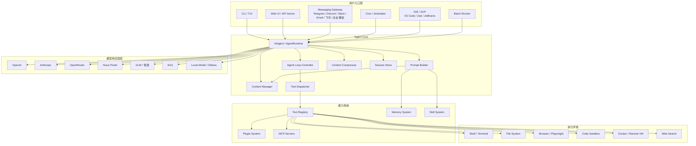

---

## 3. 核心模块说明

### 3.1 用户入口层

用户入口层负责接收不同来源的请求，并统一转交给 Agent Core。

| 模块 | 作用 |
|---|---|
| CLI / TUI | 命令行交互入口 |
| Web UI / API Server | Web 页面或 HTTP API 调用入口 |
| Messaging Gateway | 接入 Telegram、Discord、Slack、Email、飞书、企业微信等平台 |
| Cron / Scheduler | 定时触发 Agent 任务 |
| IDE / ACP | 接入编辑器或开发工具 |
| Batch Runner | 批量执行任务 |

---

### 3.2 Agent Core

Agent Core 是 Hermes Agent 的大脑，负责对话循环、模型调用、工具调度、上下文管理和会话持久化。

| 模块 | 作用 |
|---|---|
| AIAgent / AgentRuntime | 核心运行时，负责完整 Agent 执行流程 |
| Prompt Builder | 组装 system prompt、记忆、技能、项目上下文 |
| Context Manager | 管理当前会话上下文 |
| Agent Loop Controller | 控制模型调用与工具调用循环 |
| Tool Dispatcher | 执行模型请求的 tool call |
| Context Compressor | 上下文过长时进行压缩 |
| Session Store | 保存会话历史、消息、工具调用记录 |

---

### 3.3 能力系统

能力系统是 Agent 的外部能力来源，包括工具、记忆、技能、插件和 MCP。

| 模块 | 作用 |
|---|---|
| Tool Registry | 注册和管理所有工具 |
| Memory System | 管理长期记忆，如用户偏好、项目背景、历史经验 |
| Skill System | 管理可复用技能，如前端开发、Playwright 自动化、文档生成等 |
| Plugin System | 允许用户扩展自定义工具和 Hook |
| MCP Servers | 接入外部 MCP 工具生态 |

---

### 3.4 模型供应商层

Provider Layer 用来隔离不同大模型 API 的差异。

常见模型来源包括：

- OpenAI
- Anthropic
- OpenRouter
- Nous Portal
- GLM / 智谱
- Kimi
- DeepSeek
- Qwen
- 本地模型 / Ollama

核心思想是：Agent Core 不直接依赖某个模型 API，而是依赖统一的 ModelProvider 接口。

---

## 4. 主流程图：用户请求到最终响应

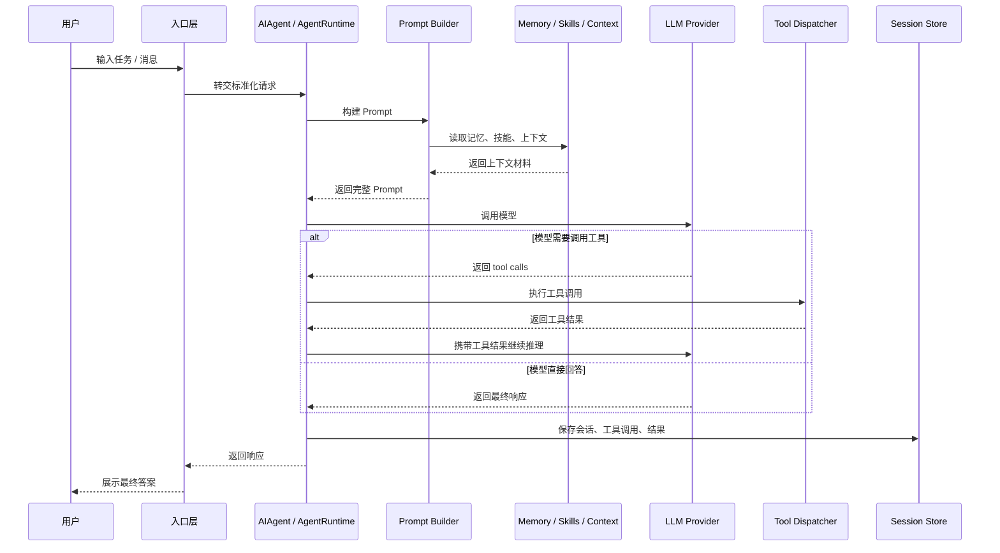

---

## 5. Agent Loop 流程图

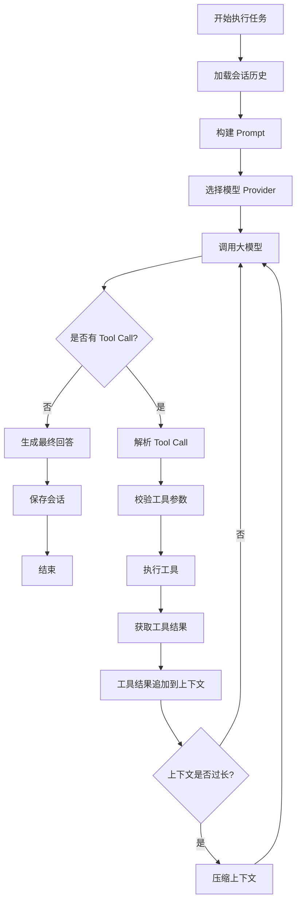

---

## 6. Tool Calling 流程图

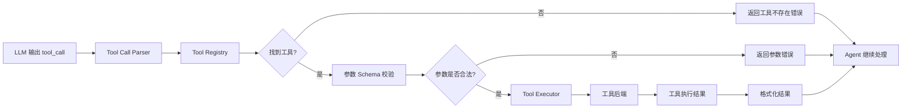

工具注册示意：

```ts
interface Tool {
  name: string
  description: string
  schema: JSONSchema
  execute(args: unknown, context: ToolContext): Promise<ToolResult>
}

class ToolRegistry {
  private tools = new Map<string, Tool>()

  register(tool: Tool) {
    this.tools.set(tool.name, tool)
  }

  getSchemas() {
    return [...this.tools.values()].map(tool => ({
      name: tool.name,
      description: tool.description,
      parameters: tool.schema,
    }))
  }

  async dispatch(name: string, args: unknown, context: ToolContext) {
    const tool = this.tools.get(name)
    if (!tool) {
      throw new Error(`Tool not found: ${name}`)
    }
    return tool.execute(args, context)
  }
}
```

---

## 7. Memory 流程图

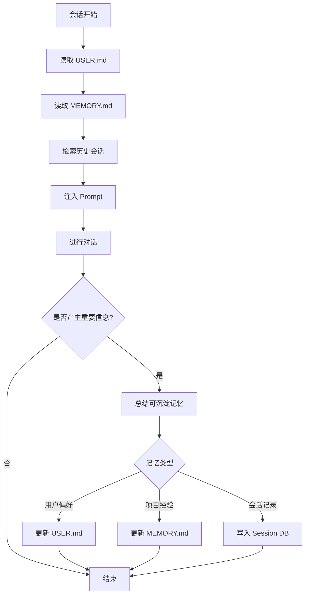

推荐记忆分层：

```text
memory/
├─ USER.md       # 用户长期偏好、沟通习惯、常用工具
├─ MEMORY.md     # Agent 工作经验、项目背景、环境信息
└─ sessions.db   # 会话历史、全文检索、工具调用记录
```

---

## 8. Skill System 流程图

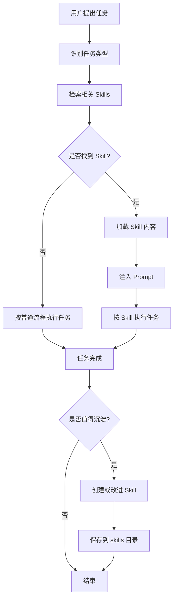

Skill 文件结构建议：

```text
skills/
├─ frontend-design/
│  └─ SKILL.md
├─ playwright-automation/
│  └─ SKILL.md
├─ document-writing/
│  └─ SKILL.md
├─ api-integration/
│  └─ SKILL.md
└─ code-review/
   └─ SKILL.md
```

单个 Skill 推荐格式：

```md
# Skill: Frontend Design

## 适用场景

用于生成高质量前端页面、组件、落地页、控制台界面。

## 工作流程

1. 理解业务目标
2. 确认页面信息架构
3. 设计布局和视觉层级
4. 生成组件代码
5. 检查响应式和可访问性

## 输出规范

- 使用清晰的组件结构
- 保持视觉层级
- 优先使用设计系统组件
- 避免过度装饰
- 提供可直接运行的代码

## 检查清单

- 是否移动端适配
- 是否有空状态
- 是否有加载状态
- 是否有错误状态
- 是否符合品牌调性
```

---

## 9. Gateway 流程图

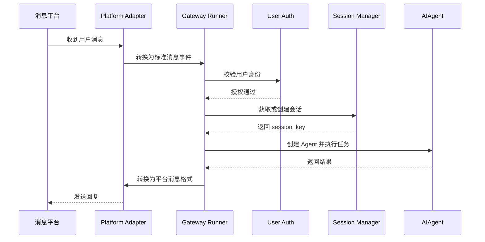

---

## 10. Cron / Scheduler 流程图

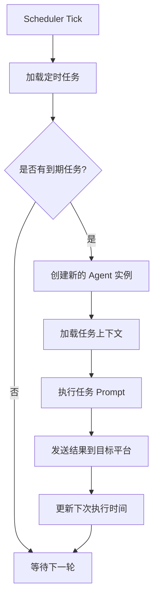

示例任务：

```text
每天早上 9 点：
帮我汇总昨天 GitHub issues、未读邮件、服务器告警，并发送到飞书。
```

---

## 11. 复刻版推荐工程结构

```text
hermes-clone/
├─ apps/
│  ├─ cli/
│  ├─ web/
│  └─ gateway/
│
├─ packages/
│  ├─ agent-core/
│  │  ├─ AgentRuntime.ts
│  │  ├─ PromptBuilder.ts
│  │  ├─ ContextManager.ts
│  │  ├─ ToolDispatcher.ts
│  │  ├─ LoopController.ts
│  │  └─ SessionStore.ts
│  │
│  ├─ providers/
│  │  ├─ OpenAIProvider.ts
│  │  ├─ AnthropicProvider.ts
│  │  ├─ OpenRouterProvider.ts
│  │  ├─ DeepSeekProvider.ts
│  │  ├─ GLMProvider.ts
│  │  ├─ KimiProvider.ts
│  │  └─ OllamaProvider.ts
│  │
│  ├─ tools/
│  │  ├─ ToolRegistry.ts
│  │  ├─ FileTool.ts
│  │  ├─ ShellTool.ts
│  │  ├─ BrowserTool.ts
│  │  ├─ WebSearchTool.ts
│  │  ├─ CodeExecutionTool.ts
│  │  ├─ MemoryTool.ts
│  │  └─ MCPTool.ts
│  │
│  ├─ memory/
│  │  ├─ MemoryStore.ts
│  │  ├─ UserProfileStore.ts
│  │  ├─ SessionSearch.ts
│  │  └─ VectorStore.ts
│  │
│  ├─ skills/
│  │  ├─ SkillLoader.ts
│  │  ├─ SkillSearch.ts
│  │  ├─ SkillWriter.ts
│  │  └─ SkillImprover.ts
│  │
│  ├─ gateway/
│  │  ├─ Adapter.ts
│  │  ├─ TelegramAdapter.ts
│  │  ├─ DiscordAdapter.ts
│  │  ├─ FeishuAdapter.ts
│  │  ├─ WecomAdapter.ts
│  │  └─ EmailAdapter.ts
│  │
│  └─ scheduler/
│     ├─ JobStore.ts
│     ├─ Scheduler.ts
│     └─ JobRunner.ts
│
├─ data/
│  ├─ memories/
│  │  ├─ USER.md
│  │  └─ MEMORY.md
│  ├─ skills/
│  ├─ sessions.sqlite
│  └─ config.yaml
│
└─ README.md
```

---

## 12. 最小 MVP 架构

如果要先做一个能跑起来的 Hermes Agent 复刻版，建议先实现以下模块：

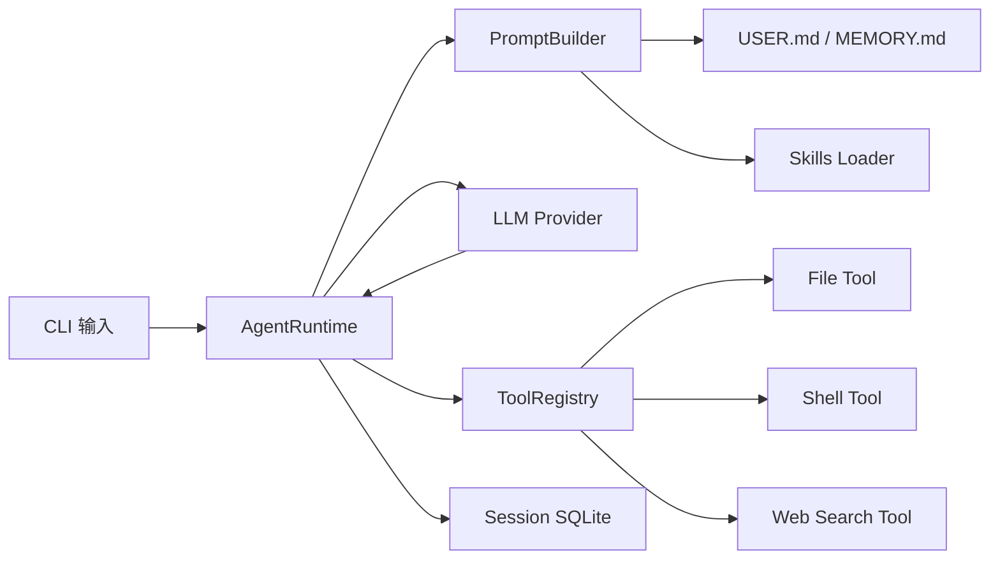

MVP 模块优先级：

| 优先级 | 模块 | 说明 |
|---|---|---|
| P0 | AgentRuntime | 核心对话循环 |
| P0 | ModelProvider | 统一模型调用接口 |
| P0 | PromptBuilder | 注入记忆、技能、上下文 |
| P0 | ToolRegistry | 工具注册与调用 |
| P0 | FileTool / ShellTool | 基础执行能力 |
| P1 | MemoryStore | USER.md / MEMORY.md |
| P1 | SkillLoader | 加载技能文档 |
| P1 | SessionStore | SQLite 保存历史 |
| P2 | Web UI | 图形界面 |
| P2 | Gateway | 接入消息平台 |
| P2 | Scheduler | 定时任务 |
| P3 | MCP / Plugin | 扩展生态 |

---

## 13. 关键设计原则

### 13.1 核心和入口解耦

不要把 Telegram、Web、CLI 的逻辑写进 Agent Core。入口层只负责消息适配，所有请求最终都转换成统一格式交给 AgentRuntime。

### 13.2 模型和 Agent 解耦

Agent Core 不应该依赖 OpenAI 或 Anthropic 的具体 API 格式，而应该通过统一 Provider 接口调用模型。

### 13.3 工具必须可注册、可描述、可校验

每个工具都应该包含：

- name
- description
- JSON Schema
- execute function
- permission / sandbox policy

### 13.4 记忆要分层

不要把所有历史都塞进 prompt。推荐区分：

- 用户长期偏好
- 项目长期上下文
- 当前会话上下文
- 历史会话检索
- 可复用技能

### 13.5 Skills 是过程记忆

Memory 记录“事实”，Skills 记录“怎么做”。

例如：

- 用户喜欢简洁中文回答：Memory
- 如何用 Playwright 自动化登录后台：Skill
- 某项目使用 Next.js + Supabase：Memory
- 如何生成高质量落地页：Skill

---

## 14. 开发计划

下面按照“先跑通 Agent Core，再扩展工具、记忆、技能、入口和自动化”的顺序拆分开发计划。

### 14.1 开发阶段总览

| 阶段 | 目标 | 核心产出 | 建议周期 |
|---|---|---|---|
| Phase 0 | 项目初始化 | Monorepo、基础配置、日志、环境变量、README | 1-2 天 |
| Phase 1 | Agent Core MVP | CLI 可对话、Provider 可调用、Session 可保存 | 3-5 天 |
| Phase 2 | Tool System | ToolRegistry、FileTool、ShellTool、WebSearchTool | 3-5 天 |
| Phase 3 | Memory System | USER.md、MEMORY.md、Session SQLite、历史检索 | 3-5 天 |
| Phase 4 | Skill System | SkillLoader、SkillSearch、SkillWriter、内置 Skills | 3-5 天 |
| Phase 5 | Web UI / API | HTTP API、Web Chat、会话列表、工具调用展示 | 5-7 天 |
| Phase 6 | Gateway | 飞书 / 企业微信 / Telegram 等消息入口 | 5-7 天 |
| Phase 7 | Scheduler | 自然语言定时任务、任务存储、任务执行器 | 3-5 天 |
| Phase 8 | MCP / Plugin | MCP 客户端、插件加载、权限控制 | 5-10 天 |
| Phase 9 | 稳定化 | 测试、安全沙箱、错误恢复、部署文档 | 持续迭代 |

---

## 15. MVP 开发计划

### 15.1 MVP 目标

MVP 不追求完整复刻 Hermes Agent，而是先实现一个可以本地运行的最小 Agent：

```text
用户在 CLI 输入任务
→ AgentRuntime 构建 Prompt
→ 调用大模型
→ 模型可选择调用工具
→ 工具执行后把结果回灌模型
→ 输出最终结果
→ 保存会话历史
```

MVP 必须具备：

- CLI 入口
- AgentRuntime 核心循环
- ModelProvider 抽象
- 至少一个可用模型 Provider
- ToolRegistry
- FileTool
- ShellTool
- PromptBuilder
- SessionStore
- 基础配置系统

暂时不做：

- Web UI
- 多平台 Gateway
- 复杂记忆自动更新
- MCP
- 插件市场
- 多 Agent 协作

---

### 15.2 MVP 目录结构

```text
hermes-clone/
├─ apps/
│  └─ cli/
│     ├─ src/
│     │  ├─ index.ts
│     │  └─ commands/
│     └─ package.json
│
├─ packages/
│  ├─ agent-core/
│  │  ├─ src/
│  │  │  ├─ AgentRuntime.ts
│  │  │  ├─ PromptBuilder.ts
│  │  │  ├─ LoopController.ts
│  │  │  ├─ types.ts
│  │  │  └─ index.ts
│  │  └─ package.json
│  │
│  ├─ providers/
│  │  ├─ src/
│  │  │  ├─ ModelProvider.ts
│  │  │  ├─ OpenAIProvider.ts
│  │  │  ├─ DeepSeekProvider.ts
│  │  │  └─ index.ts
│  │  └─ package.json
│  │
│  ├─ tools/
│  │  ├─ src/
│  │  │  ├─ ToolRegistry.ts
│  │  │  ├─ FileTool.ts
│  │  │  ├─ ShellTool.ts
│  │  │  ├─ types.ts
│  │  │  └─ index.ts
│  │  └─ package.json
│  │
│  ├─ memory/
│  │  ├─ src/
│  │  │  ├─ MemoryStore.ts
│  │  │  ├─ SessionStore.ts
│  │  │  └─ index.ts
│  │  └─ package.json
│  │
│  └─ config/
│     ├─ src/
│     │  ├─ loadConfig.ts
│     │  └─ types.ts
│     └─ package.json
│
├─ data/
│  ├─ memories/
│  │  ├─ USER.md
│  │  └─ MEMORY.md
│  ├─ skills/
│  └─ sessions.sqlite
│
├─ package.json
├─ pnpm-workspace.yaml
├─ tsconfig.base.json
└─ README.md
```

---

## 16. 详细开发任务拆解

### Phase 0：项目初始化

目标：建立可维护的工程骨架。

任务：

1. 初始化 Monorepo
2. 配置 TypeScript
3. 配置 ESLint / Prettier
4. 配置 pnpm workspace
5. 创建基础 packages
6. 创建 `.env.example`
7. 创建 `config.yaml`
8. 创建日志模块
9. 编写基础 README

验收标准：

- 可以执行 `pnpm install`
- 可以执行 `pnpm build`
- 可以执行 `pnpm lint`
- CLI 能输出版本号

---

### Phase 1：Agent Core MVP

目标：实现最小可用的 Agent 对话循环。

任务：

1. 定义 `Message`、`ToolCall`、`AgentContext`、`AgentResult` 类型
2. 实现 `ModelProvider` 接口
3. 实现一个 Provider，例如 OpenAI / DeepSeek / OpenRouter
4. 实现 `PromptBuilder`
5. 实现 `AgentRuntime.run()`
6. 实现 CLI 输入输出
7. 支持多轮会话
8. 支持流式输出，可后置实现

核心接口示意：

```ts
export interface ModelProvider {
  name: string
  chat(input: ModelChatInput): Promise<ModelChatResult>
}

export interface AgentRuntime {
  run(input: AgentRunInput): Promise<AgentRunResult>
}
```

验收标准：

- CLI 输入一句话，可以获得模型回复
- 支持读取历史消息
- 支持保存本轮消息
- Provider 可以通过配置切换

---

### Phase 2：Tool System

目标：让模型能够调用工具。

任务：

1. 实现 `Tool` 接口
2. 实现 `ToolRegistry`
3. 实现工具 JSON Schema 输出
4. 实现 `ToolDispatcher`
5. 接入 Agent Loop
6. 实现 `FileTool`
7. 实现 `ShellTool`
8. 对 ShellTool 增加白名单、超时、工作目录限制
9. 增加工具执行日志

工具调用流程：

```text
模型返回 tool_call
→ ToolDispatcher 解析工具名和参数
→ ToolRegistry 查找工具
→ Schema 校验参数
→ 执行工具
→ 返回工具结果
→ 工具结果追加到 messages
→ 再次调用模型
```

验收标准：

- 模型可以调用 `read_file`
- 模型可以调用 `write_file`
- 模型可以调用 `list_files`
- 模型可以调用受限 `run_shell`
- 工具执行失败时，Agent 能继续处理错误信息

---

### Phase 3：Memory System

目标：让 Agent 具备长期上下文。

任务：

1. 创建 `data/memories/USER.md`
2. 创建 `data/memories/MEMORY.md`
3. 实现 `MemoryStore`
4. 在 PromptBuilder 中注入 Memory
5. 实现 `SessionStore`
6. 使用 SQLite 保存消息
7. 支持按 session_id 查询历史
8. 支持简单关键词搜索历史会话
9. 后续升级为 SQLite FTS5

记忆注入流程：

```text
会话开始
→ 读取 USER.md
→ 读取 MEMORY.md
→ 查询当前 session 历史
→ 拼接 system prompt
→ 调用模型
```

验收标准：

- 修改 USER.md 后，Agent 回答能体现用户偏好
- 修改 MEMORY.md 后，Agent 能使用项目背景
- CLI 重启后仍能恢复历史会话

---

### Phase 4：Skill System

目标：让 Agent 可以加载可复用技能。

任务：

1. 定义 Skill 目录规范
2. 实现 `SkillLoader`
3. 实现 `SkillSearch`
4. 支持通过关键词加载 Skill
5. 在 PromptBuilder 注入相关 Skill
6. 内置 3 个基础 Skill：
   - frontend-design
   - code-review
   - playwright-automation
7. 后续实现 `SkillWriter` 自动沉淀技能

Skill 加载流程：

```text
用户任务输入
→ 提取关键词
→ 检索 skills 目录
→ 找到相关 SKILL.md
→ 注入 Prompt
→ Agent 按技能流程执行
```

验收标准：

- 用户输入“帮我设计页面”，自动加载 frontend-design Skill
- 用户输入“帮我做代码审查”，自动加载 code-review Skill
- Skill 内容能影响 Agent 输出结构和质量

---

### Phase 5：Web UI / API

目标：提供可视化交互和 HTTP API。

任务：

1. 创建 `apps/web`
2. 实现 `POST /api/chat`
3. 实现 `GET /api/sessions`
4. 实现 `GET /api/sessions/:id/messages`
5. 实现 Web Chat 页面
6. 展示工具调用过程
7. 展示会话列表
8. 支持切换模型
9. 支持编辑 Memory
10. 支持查看 Skills

验收标准：

- 浏览器可以聊天
- 可以看到工具调用记录
- 可以查看历史会话
- 可以切换模型 Provider

---

### Phase 6：Gateway

目标：接入消息平台，让 Agent 成为长期在线助手。

推荐优先级：

1. 飞书 Bot
2. 企业微信 Bot
3. Telegram Bot
4. Email
5. Discord / Slack

任务：

1. 定义统一 `PlatformAdapter` 接口
2. 实现 `GatewayRunner`
3. 实现用户身份映射
4. 实现 session_key 生成规则
5. 实现消息标准化
6. 实现回复发送
7. 增加平台鉴权
8. 增加平台限流

统一消息格式：

```ts
interface PlatformMessage {
  platform: string
  userId: string
  channelId: string
  text: string
  attachments?: Attachment[]
  raw: unknown
}
```

验收标准：

- 飞书或企业微信中可以直接和 Agent 对话
- 不同用户拥有不同 session
- Gateway 崩溃重启后会话不丢失

---

### Phase 7：Scheduler

目标：支持自然语言定时任务。

任务：

1. 实现 `JobStore`
2. 实现 `Scheduler`
3. 支持 cron 表达式
4. 支持一次性任务
5. 支持周期性任务
6. 支持任务目标平台，例如 CLI、Web、飞书
7. 支持任务执行日志
8. 支持失败重试

任务执行流程：

```text
Scheduler 定时扫描
→ 找到到期 Job
→ 创建 AgentRuntime
→ 加载 Job Prompt
→ 执行任务
→ 发送结果
→ 更新 next_run_at
```

验收标准：

- 可以创建“每天 9 点总结项目状态”的任务
- 到点后自动执行 Agent
- 执行结果能发到指定入口
- 失败任务有日志和重试

---

### Phase 8：MCP / Plugin

目标：增强扩展能力。

任务：

1. 实现 MCP Client
2. 支持配置 MCP Server
3. 自动发现 MCP 工具
4. 将 MCP 工具注册到 ToolRegistry
5. 实现插件目录加载
6. 支持插件注册工具
7. 支持插件注册 Hook
8. 增加权限隔离

验收标准：

- 可以接入 Playwright MCP
- 可以接入 GitHub MCP
- 自定义插件可以注册工具
- 插件异常不会导致主进程崩溃

---

## 17. 开发流程

### 17.1 单个功能开发流程

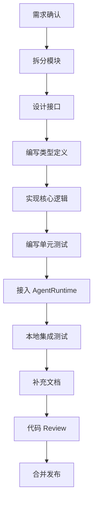

如果当前环境不能渲染 Mermaid，可以看下面的纯文本版本：

```text
需求确认
  ↓
拆分模块
  ↓
设计接口
  ↓
编写类型定义
  ↓
实现核心逻辑
  ↓
编写单元测试
  ↓
接入 AgentRuntime
  ↓
本地集成测试
  ↓
补充文档
  ↓
代码 Review
  ↓
合并发布
```

---

### 17.2 Agent Core 开发流程

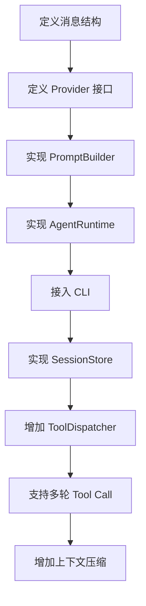

纯文本版本：

```text
定义消息结构
  ↓
定义 Provider 接口
  ↓
实现 PromptBuilder
  ↓
实现 AgentRuntime
  ↓
接入 CLI
  ↓
实现 SessionStore
  ↓
增加 ToolDispatcher
  ↓
支持多轮 Tool Call
  ↓
增加上下文压缩
```

---

### 17.3 Tool 开发流程

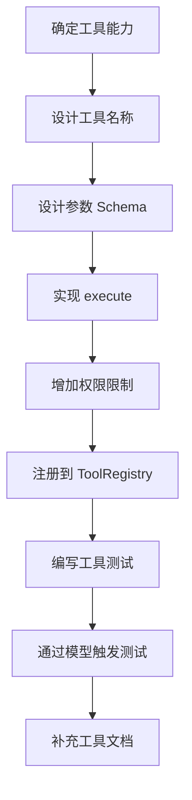

纯文本版本：

```text
确定工具能力
  ↓
设计工具名称
  ↓
设计参数 Schema
  ↓
实现 execute
  ↓
增加权限限制
  ↓
注册到 ToolRegistry
  ↓
编写工具测试
  ↓
通过模型触发测试
  ↓
补充工具文档
```

---

### 17.4 Provider 开发流程

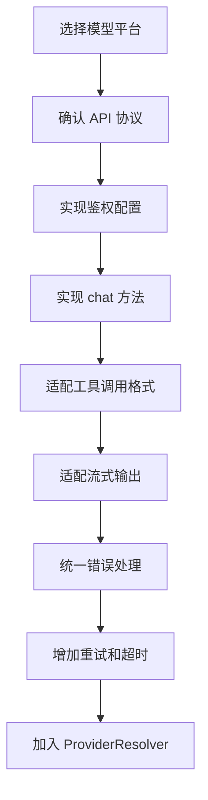

纯文本版本：

```text
选择模型平台
  ↓
确认 API 协议
  ↓
实现鉴权配置
  ↓
实现 chat 方法
  ↓
适配工具调用格式
  ↓
适配流式输出
  ↓
统一错误处理
  ↓
增加重试和超时
  ↓
加入 ProviderResolver
```

---

### 17.5 Gateway 开发流程

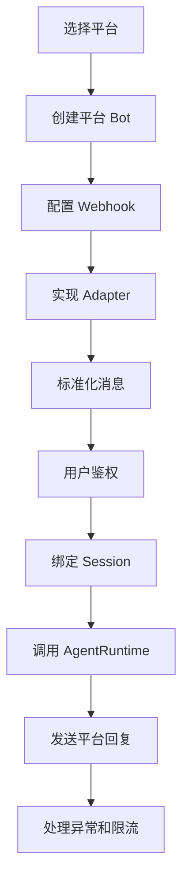

纯文本版本：

```text
选择平台
  ↓
创建平台 Bot
  ↓
配置 Webhook
  ↓
实现 Adapter
  ↓
标准化消息
  ↓
用户鉴权
  ↓
绑定 Session
  ↓
调用 AgentRuntime
  ↓
发送平台回复
  ↓
处理异常和限流
```

---

## 18. 推荐开发里程碑

### Milestone 1：本地 CLI Agent 可用

目标：本地可以对话。

交付物：

- CLI
- AgentRuntime
- PromptBuilder
- OpenAI / DeepSeek / OpenRouter Provider
- SessionStore

验收命令：

```bash
pnpm cli chat
```

验收结果：

```text
用户输入：你好，介绍一下你自己
Agent 输出：我是一个本地运行的 Agent，可以调用工具、读取记忆并执行任务。
```

---

### Milestone 2：工具调用可用

目标：Agent 可以操作文件和执行受限命令。

交付物：

- ToolRegistry
- ToolDispatcher
- FileTool
- ShellTool
- 工具调用日志

验收案例：

```text
用户输入：帮我查看当前目录有哪些文件
Agent 行为：调用 list_files
Agent 输出：列出文件列表
```

---

### Milestone 3：记忆系统可用

目标：Agent 能读取长期记忆。

交付物：

- USER.md
- MEMORY.md
- MemoryStore
- Session SQLite
- 历史会话恢复

验收案例：

```text
USER.md 中写入：用户喜欢简洁中文回答。
用户输入：解释一下 AgentRuntime。
Agent 输出：使用简洁中文解释，而不是长篇英文。
```

---

### Milestone 4：技能系统可用

目标：Agent 能按技能执行任务。

交付物：

- SkillLoader
- SkillSearch
- 内置 Skills
- Prompt 注入技能

验收案例：

```text
用户输入：帮我设计一个后台首页
Agent 行为：加载 frontend-design Skill
Agent 输出：包含信息架构、布局、组件和代码建议
```

---

### Milestone 5：Web UI 可用

目标：可以在浏览器里使用 Agent。

交付物：

- Web Chat
- API Server
- 会话列表
- 工具调用展示
- 模型切换

验收案例：

```text
打开 http://localhost:3000
输入任务
查看回复、工具调用记录和历史会话
```

---

### Milestone 6：企业微信 / 飞书 Bot 可用

目标：Agent 可以在消息平台中使用。

交付物：

- GatewayRunner
- PlatformAdapter
- FeishuAdapter 或 WecomAdapter
- 用户授权
- Session 路由

验收案例：

```text
在飞书群里 @Agent：帮我总结今天的任务
Agent 返回总结结果
```

---

### Milestone 7：定时任务可用

目标：Agent 可以自动执行周期任务。

交付物：

- Scheduler
- JobStore
- JobRunner
- 失败重试
- 任务执行日志

验收案例：

```text
创建任务：每天 9 点汇总项目状态
到点后 Agent 自动执行并发送结果
```

---

## 19. 开发优先级建议

### 19.1 第一优先级：跑通闭环

必须优先完成：

1. CLI 输入
2. PromptBuilder
3. Provider 调用
4. AgentRuntime 循环
5. SessionStore
6. ToolRegistry
7. FileTool / ShellTool

不要一开始就做 Web UI、Gateway、MCP，否则容易变成外围功能很多，但核心 Agent 不稳定。

---

### 19.2 第二优先级：增强 Agent 能力

核心闭环跑通后，再做：

1. MemoryStore
2. SkillLoader
3. WebSearchTool
4. ContextCompressor
5. Tool 权限控制
6. 错误恢复机制

---

### 19.3 第三优先级：扩展入口和生态

最后再做：

1. Web UI
2. 飞书 / 企业微信 Gateway
3. Scheduler
4. MCP
5. Plugin
6. 多用户权限
7. 部署控制台

---

## 20. 测试计划

### 20.1 单元测试

| 模块 | 测试内容 |
|---|---|
| PromptBuilder | Memory / Skill / Context 是否正确拼接 |
| ToolRegistry | 工具注册、查询、重复注册处理 |
| ToolDispatcher | 参数校验、工具不存在、执行异常 |
| FileTool | 读写文件、路径限制、错误处理 |
| ShellTool | 命令执行、超时、白名单、工作目录限制 |
| SessionStore | 保存消息、读取历史、搜索会话 |
| SkillLoader | 扫描目录、加载 SKILL.md、异常处理 |
| Provider | 请求格式、响应解析、错误重试 |

---

### 20.2 集成测试

| 场景 | 验收方式 |
|---|---|
| 普通聊天 | CLI 输入问题，模型返回结果 |
| 文件读取 | 用户要求读取文件，模型调用 FileTool |
| Shell 执行 | 用户要求查看目录，模型调用 ShellTool |
| 多轮工具调用 | 模型连续调用多个工具后再总结 |
| 记忆注入 | 修改 USER.md 后影响回答风格 |
| 技能注入 | 输入特定任务后加载对应 Skill |
| 会话恢复 | 重启 CLI 后能继续上一轮会话 |
| 工具错误 | 工具失败后 Agent 能解释错误并继续 |

---

### 20.3 安全测试

重点测试：

- ShellTool 是否限制危险命令
- FileTool 是否禁止越权访问
- API Key 是否不会进入日志
- Gateway 是否校验用户身份
- Scheduler 是否禁止任意命令注入
- 插件是否有权限边界

高风险能力必须默认关闭：

- 删除文件
- 执行任意 Shell
- 访问系统根目录
- 自动发送外部消息
- 批量修改远程系统

---

## 21. 部署流程

### 21.1 本地开发部署

```bash
pnpm install
cp .env.example .env
pnpm build
pnpm cli chat
```

---

### 21.2 Web 服务部署

```bash
pnpm build
pnpm web start
```

推荐环境变量：

```env
MODEL_PROVIDER=openrouter
MODEL_NAME=deepseek/deepseek-chat
OPENROUTER_API_KEY=xxx
DATA_DIR=./data
DATABASE_URL=file:./data/sessions.sqlite
```

---

### 21.3 Docker 部署

```text
Docker Container
├─ Web API
├─ Gateway Runner
├─ Scheduler Worker
├─ SQLite / Postgres
└─ data volume
```

推荐拆分：

```text
开发阶段：单容器 + SQLite
生产阶段：API / Worker 分进程 + Postgres
企业部署：K8s + Redis Queue + Postgres + 对象存储
```

---

## 22. 风险与处理方案

| 风险 | 表现 | 处理方案 |
|---|---|---|
| Agent Loop 死循环 | 模型反复调用工具 | 设置 max_iterations |
| ShellTool 危险 | 删除文件、泄露密钥 | 默认白名单 + 沙箱 + 人工确认 |
| Prompt 过长 | 成本高、响应慢 | ContextCompressor + 历史检索 |
| 工具调用失败 | Agent 中断 | 工具错误结构化返回，让模型继续处理 |
| 多平台会话混乱 | 用户上下文串线 | platform + userId + channelId 生成 session_key |
| Provider 差异大 | 工具调用格式不一致 | Provider 层统一转换 |
| Memory 污染 | 错误信息写入长期记忆 | 记忆写入需要审核或置信度判断 |
| 插件不安全 | 插件执行危险操作 | 权限声明 + 沙箱 + 禁止默认启用 |

---

## 23. 最终总结

Hermes Agent 的核心架构可以压缩成下面这张图：

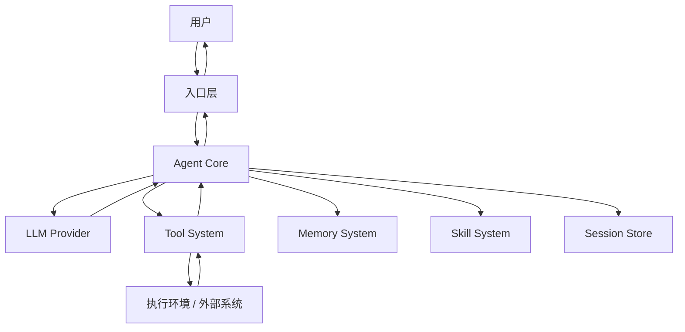

最核心的复刻顺序：

1. 先做 Agent Loop
2. 再做 Model Provider 抽象
3. 再做 Tool Registry
4. 再做 Memory 注入
5. 再做 Skills 加载
6. 再做 Session 存储
7. 最后做 Gateway、Scheduler、MCP、Plugin

只要 `Agent Loop + Tools + Memory + Skills` 这四个核心打通，就已经具备 Hermes Agent 的主要骨架。

